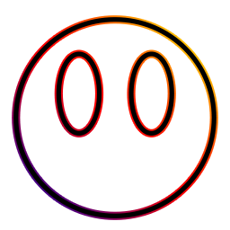

<!-- PROJECT SHIELDS -->
<!--
*** I'm using markdown "reference style" links for readability.
*** Reference links are enclosed in brackets [ ] instead of parentheses ( ).
*** See the bottom of this document for the declaration of the reference variables
*** for contributors-url, forks-url, etc. This is an optional, concise syntax you may use.
*** https://www.markdownguide.org/basic-syntax/#reference-style-links
-->

[![Contributors][contributors-shield]][contributors-url]
[![Forks][forks-shield]][forks-url]
[![Stargazers][stars-shield]][stars-url]
[![Issues][issues-shield]][issues-url]
[![License: GPL v3][license-shield]][license-url]
[![LinkedIn][linkedin-shield]][linkedin-url]

<!-- PROJECT LOGO -->
<br />
<p align="center">
  <a href="https://github.com/nickprovs/showcase">
    
  </a>

  <h3 align="center">Showcase</h3>

  <p align="center">
    A full-stack solution to a personal portfolio with a built-in content management system.
    <br />
    <br />
  </p>
</p>

<!-- TABLE OF CONTENTS -->

## Table of Contents

- [About the Project](#about-the-project)
  - [Built With](#built-with)
- [Getting Started](#getting-started)
  - [Prerequisites](#prerequisites)
  - [Installation](#installation)
  - [Usage](#usage)
- [Contributing](#contributing)
- [License](#license)
- [Contact](#contact)
- [Acknowledgements](#acknowledgements)

<!-- ABOUT THE PROJECT -->

## About The Project

I've always wanted to build my own corner of the internet. A digital "place for my stuff".
Showcase is my answer to that desire. It's an after-hours project I've been building for months.

It has an expansive feature set that a variety of users can leverage.

- **Integrated Content-Management System:** Add, Edit, Delete, and Feature content.
- **Styling and Themes:** Content adjusts to fit user's device. Change the entire site's theme on-the-fly.
- **SEO:** Server-side rendering, user-defined slugs, auto-generated meta tags for sharing content
- **Security:** Opt-In 2FA, Secure Cookie Auth, Configurable Sanitization
- **Content:** Host your portfolio, a blog, photo, and media section. Rename or hide the portfolio section.
- **Contact:** Wire up some SMTP credentials to receive messages from prospective users.
- **Versatilitiy:** Edit most of the website at any time. Environment configuration supports a variety of deployments.
- **And More:** Pagination, Categories, Tags, Search, Addressable Highlights, etc... all implemented!

[![Product Name Screen Shot][product-screenshot]](/_meta/images/sample)

### Built With

- [next.js](https://github.com/vercel/next.js)
- [node.js](https://github.com/nodejs)

<!-- GETTING STARTED -->

## Getting Started

If you're new to these technologies, I recommened the following:

- Mosh's Series on React and Node.js
- Official Next.js Docs

To get a local copy up and running follow these simple steps.

### Prerequisites

- Node.js
- MongoDb

### Installation

1. Clone or Fork the project

```sh
git clone https://github.com/nickprovs/showcase.git
```

2. Install NPM packages

```sh
npm install
```

3. Start the client - usually from a VS Code terminal

```text
Create development.json config file using example.development.json from /config as an example
cd client
npm run dev
```

4. Start the server - usually from a VS Code terminal

```text
Update default.json config file in /config or create config files for other dev environments
cd server
npm start
```

<!-- Usage -->

### Usage

This website can be used to show your personal and/or professional content. It can always be forked, revised, or expanded for your personal needs.

The high-level architectural picture here is that the Next.js app (Client) simply hosts the pages and it gets the data from the Express API (Server).

<!-- Deployment -->

## Deployment

Both the client and server are environment configurable, so you should be able to deploy anywhere.

A good choice would be to deploy to Google Cloud's AppEngine, and MongoDB Cloud.

- Create a MongoDB Database in the cloud and get it's connection string.
- Create an AppEngine project.
- Wire up your domain name to the AppEngine project.
- Create your app.yaml's in the client and server folders based on the example files.
- Run gcloud app deploy from both the client and server directory.
- These two nodejs services will be deployed to the same AppEngine project.

<!-- CONTRIBUTING -->

## Contributing

Contributions are what make the open source community such an amazing place to be learn, inspire, and create. Any contributions you make are **greatly appreciated**.

1. Fork the Project
2. Create your Feature Branch (`git checkout -b feature/AmazingFeature`)
3. Commit your Changes (`git commit -m 'Add some AmazingFeature'`)
4. Push to the Branch (`git push origin feature/AmazingFeature`)
5. Open a Pull Request

<!-- LICENSE -->

## License

Distributed under the GNU GPLv3 License. See [License](LICENSE.md) for more information.

<!-- ACKNOWLEDGEMENTS -->

## Acknowledgements

### Client

- [massively - design influences](https://html5up.net/massively)
- [isomorphic-unfetch - isomorphic fetch for next.js](https://github.com/developit/unfetch/tree/master/packages/isomorphic-unfetch)
- [@hapi/joi - validation](https://github.com/hapijs/joi)
- [tinymce - rich text editing](https://github.com/tinymce/tinymce)
- [DOMPurify - sanitization](https://github.com/cure53/DOMPurify)
- [fontawesome - icons](https://github.com/FortAwesome/react-fontawesome)
- [nookies - next.js cookie interaction](https://github.com/maticzav/nookies)
- [reframe.js - automatic iframe sizing](https://github.com/dollarshaveclub/reframe.js/blob/master/src/reframe.js)
- [text-encoding-shim - older browser text-encoding](https://gitlab.com/PseudoPsycho/text-encoding-shim)
- [reCAPTCHA v2 - turing test](https://developers.google.com/recaptcha/intro)

### Server

- [express - REST API tooling](https://github.com/expressjs/express)
- [cors - cross-origin resource sharing](https://github.com/expressjs/cors)
- [mongoose - mongodb interaction](https://github.com/Automattic/mongoose)
- [@hapi/joi - validation](https://github.com/hapijs/joi)
- [bcrypt - encryption](https://www.npmjs.com/package/bcrypt)
- [nodemailer - email](https://github.com/nodemailer/nodemailer)
- [isomorphic-dompurify - sanitization](https://github.com/kkomelin/isomorphic-dompurify)
- [reCAPTCHA v2 - turing test validation](https://developers.google.com/recaptcha/intro)
- [moment - date interaction](https://github.com/moment/moment)
- [node-fetch - server-side http requests](https://github.com/node-fetch/node-fetch)
- [config - environment configuration clearing house](https://github.com/lorenwest/node-config)
- [jest - automated testing](https://github.com/facebook/jest)
- [supertest - automated testing http assertions](https://github.com/visionmedia/supertest)

<!-- MARKDOWN LINKS & IMAGES -->
<!-- https://www.markdownguide.org/basic-syntax/#reference-style-links -->

[contributors-shield]: https://img.shields.io/github/contributors/nickprovs/showcase.svg?style=flat-square
[contributors-url]: https://github.com/nickprovs/showcase/graphs/contributors
[forks-shield]: https://img.shields.io/github/forks/nickprovs/showcase.svg?style=flat-square
[forks-url]: https://github.com/nickprovs/showcase/network/members
[stars-shield]: https://img.shields.io/github/stars/nickprovs/showcase.svg?style=flat-square
[stars-url]: https://github.com/nickprovs/Showcase/stargazers
[issues-shield]: https://img.shields.io/github/issues/nickprovs/Showcase.svg?style=flat-square
[issues-url]: https://github.com/nickprovs/Showcase/issues
[license-shield]: https://img.shields.io/badge/License-GPLv3-blue.svg
[license-url]: https://github.com/nickprovs/Showcase/blob/master/LICENSE.txt
[linkedin-shield]: https://img.shields.io/badge/-LinkedIn-black.svg?style=flat-square&logo=linkedin&colorB=555
[linkedin-url]: https://linkedin.com/in/nickprovs
[product-screenshot]: _meta/images/sample/light_theme_home.jpg
